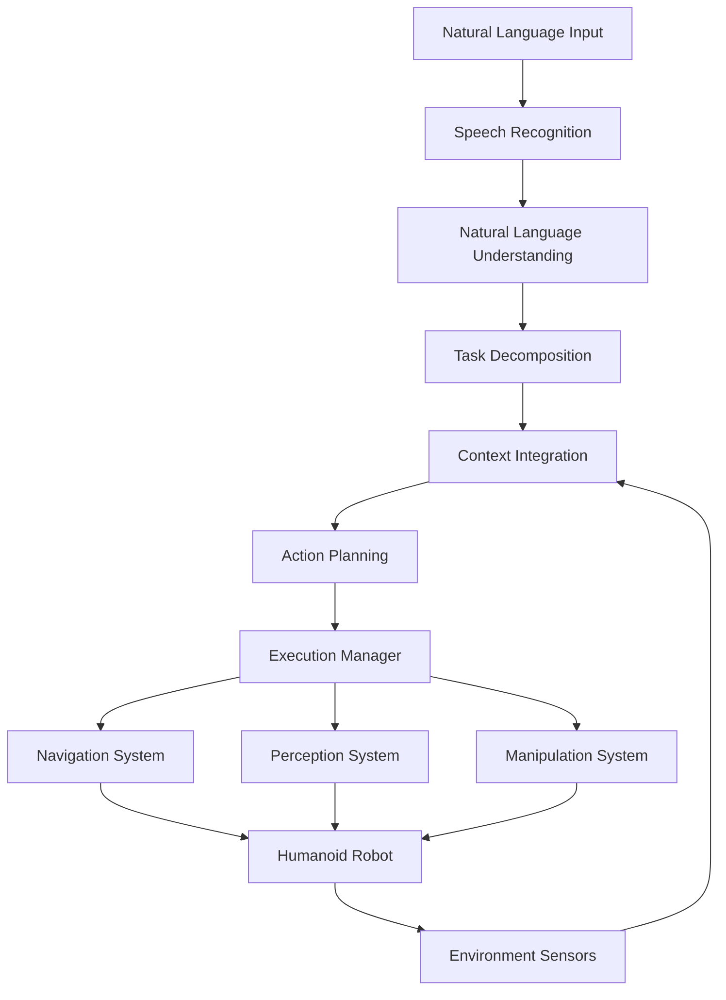

# Capstone: Autonomous Humanoid

## Introduction to End-to-End VLA Systems

In this capstone chapter, we'll integrate all the concepts learned in previous modules and chapters to create a complete Vision-Language-Action (VLA) system for an autonomous humanoid robot. This comprehensive project will combine speech recognition, natural language understanding, task decomposition, navigation, perception, and manipulation into a unified conversational robotic system.

### Learning Objectives
- Design and implement an end-to-end VLA system architecture
- Integrate navigation, perception, and manipulation with language understanding
- Create a complete conversational humanoid system
- Test and validate the integrated system in real-world scenarios

### Prerequisites
- Completion of Modules 1-3 (ROS 2 fundamentals, digital twin simulation, AI-robot brain)
- Understanding of voice-to-action pipelines (Chapter 1)
- Knowledge of language-guided planning (Chapter 2)
- Basic understanding of humanoid robot hardware and control systems

## System Architecture Design

The end-to-end VLA system architecture must efficiently integrate all components while maintaining real-time performance and reliability.

### High-Level Architecture

Here's the overall architecture for the VLA system:



### Core System Components

Here's an implementation of the main VLA system orchestrator:

```python
import rospy
import openai
import whisper
import json
from std_msgs.msg import String
from sensor_msgs.msg import LaserScan, Image
from geometry_msgs.msg import PoseStamped
from typing import Dict, List, Any, Optional
from threading import Thread
import time

class VLASystemOrchestrator:
    def __init__(self, openai_api_key: str):
        # Initialize API keys
        openai.api_key = openai_api_key

        # Initialize ROS node
        rospy.init_node('vla_system_orchestrator')

        # Initialize Whisper model
        self.whisper_model = whisper.load_model("base")

        # Publishers and subscribers
        self.voice_command_pub = rospy.Publisher('/voice_commands', String, queue_size=10)
        self.natural_language_pub = rospy.Publisher('/natural_language_tasks', String, queue_size=10)
        self.system_status_pub = rospy.Publisher('/vla_system_status', String, queue_size=10)

        self.voice_command_sub = rospy.Subscriber('/voice_commands', String, self.voice_command_callback)
        self.task_status_sub = rospy.Subscriber('/task_execution_status', String, self.task_status_callback)

        # System state
        self.current_task = None
        self.system_state = "idle"  # idle, listening, processing, executing
        self.context_data = {}

        # Audio recording parameters
        self.chunk = 1024
        self.format = pyaudio.paInt16
        self.channels = 1
        self.rate = 44100
        self.record_seconds = 3
        self.audio = pyaudio.PyAudio()

        # Start voice listening thread
        self.voice_thread = Thread(target=self.voice_listening_loop)
        self.voice_thread.daemon = True
        self.voice_thread.start()

        rospy.loginfo("VLA System Orchestrator initialized")

    def voice_listening_loop(self):
        """Continuously listen for voice commands"""
        while not rospy.is_shutdown():
            if self.system_state == "idle":
                try:
                    # Record audio
                    audio_file = self.record_audio()

                    # Transcribe audio to text
                    command_text = self.whisper_model.transcribe(audio_file)["text"]

                    if command_text.strip():  # Only process non-empty commands
                        rospy.loginfo(f"Recognized command: {command_text}")
                        self.process_voice_command(command_text)
                except Exception as e:
                    rospy.logerr(f"Error in voice listening: {e}")

            time.sleep(0.5)  # Small delay to prevent excessive CPU usage

    def record_audio(self):
        """Record audio from microphone"""
        stream = self.audio.open(
            format=self.format,
            channels=self.channels,
            rate=self.rate,
            input=True,
            frames_per_buffer=self.chunk
        )

        rospy.loginfo("Recording voice command...")
        frames = []

        for i in range(0, int(self.rate / self.chunk * self.record_seconds)):
            data = stream.read(self.chunk)
            frames.append(data)

        rospy.loginfo("Finished recording")

        stream.stop_stream()
        stream.close()

        # Save as WAV file
        filename = f"command_{int(time.time())}.wav"
        wf = wave.open(filename, 'wb')
        wf.setnchannels(self.channels)
        wf.setsampwidth(self.audio.get_sample_size(self.format))
        wf.setframerate(self.rate)
        wf.writeframes(b''.join(frames))
        wf.close()

        return filename

    def process_voice_command(self, command_text: str):
        """Process a recognized voice command"""
        self.system_state = "processing"

        # Update system status
        status_msg = String()
        status_msg.data = json.dumps({
            "state": self.system_state,
            "command": command_text,
            "timestamp": rospy.Time.now().to_sec()
        })
        self.system_status_pub.publish(status_msg)

        # Send to natural language understanding
        self.natural_language_pub.publish(command_text)

    def voice_command_callback(self, msg: String):
        """Handle processed voice commands"""
        command_text = msg.data
        rospy.loginfo(f"Processing voice command: {command_text}")

        # This would trigger the full processing pipeline
        # In practice, this might involve calling other nodes
        self.execute_task_from_command(command_text)

    def task_status_callback(self, msg: String):
        """Handle task execution status updates"""
        try:
            status_data = json.loads(msg.data)
            task_id = status_data.get("task_id")
            status = status_data.get("status")

            rospy.loginfo(f"Task {task_id} status: {status}")

            if status == "completed":
                self.system_state = "idle"
                self.current_task = None
            elif status == "failed":
                self.system_state = "idle"
                self.current_task = None
                rospy.logerr(f"Task {task_id} failed")
        except json.JSONDecodeError:
            rospy.logerr("Could not parse task status message")

    def execute_task_from_command(self, command: str):
        """Execute a task based on a natural language command"""
        # This would typically involve:
        # 1. Sending command to LLM for task decomposition
        # 2. Getting plan from language-guided planner
        # 3. Executing the plan through action manager
        rospy.loginfo(f"Executing task from command: {command}")

        # In a real system, this would interface with the planning and execution components
        # For now, we'll just log the command
        self.system_state = "executing"

    def get_system_context(self) -> Dict[str, Any]:
        """Get current system context"""
        return {
            "state": self.system_state,
            "current_task": self.current_task,
            "timestamp": rospy.Time.now().to_sec(),
            "capabilities": {
                "navigation": True,
                "manipulation": True,
                "perception": True,
                "speech_recognition": True,
                "natural_language_understanding": True
            }
        }

    def run(self):
        """Run the VLA system"""
        rate = rospy.Rate(1)  # 1 Hz

        while not rospy.is_shutdown():
            # Publish system status periodically
            status_msg = String()
            status_msg.data = json.dumps(self.get_system_context())
            self.system_status_pub.publish(status_msg)

            rate.sleep()

if __name__ == '__main__':
    import pyaudio
    import wave

    # Initialize with your OpenAI API key
    api_key = rospy.get_param('~openai_api_key', 'your-api-key-here')
    vla_system = VLASystemOrchestrator(api_key)

    try:
        vla_system.run()
    except rospy.ROSInterruptException:
        pass
    finally:
        # Clean up audio resources
        vla_system.audio.terminate()
```

## Integration of Navigation, Perception, and Manipulation

The core of the VLA system is the seamless integration of navigation, perception, and manipulation capabilities with language understanding.

### Integrated Action Manager

Here's an implementation that coordinates all three capabilities:

```python
import rospy
import actionlib
from move_base_msgs.msg import MoveBaseAction, MoveBaseGoal
from geometry_msgs.msg import PoseStamped, Point, Quaternion
from sensor_msgs.msg import Image, PointCloud2
from std_msgs.msg import String
from visualization_msgs.msg import MarkerArray
from tf.transformations import quaternion_from_euler
import json
from typing import Dict, Any, List
import numpy as np

class IntegratedActionManager:
    def __init__(self):
        rospy.init_node('integrated_action_manager')

        # Action clients
        self.move_base_client = actionlib.SimpleActionClient('move_base', MoveBaseAction)
        # Note: In a real humanoid system, you would have additional action clients for manipulation, etc.

        # Publishers and subscribers
        self.action_sub = rospy.Subscriber('/vla_actions', String, self.action_callback)
        self.status_pub = rospy.Publisher('/action_execution_status', String, queue_size=10)
        self.marker_pub = rospy.Publisher('/visualization_markers', MarkerArray, queue_size=10)

        # Wait for action servers
        rospy.loginfo("Waiting for move_base action server...")
        self.move_base_client.wait_for_server()
        rospy.loginfo("Connected to move_base action server")

        # Location mapping
        self.location_map = {
            "kitchen": {"x": 1.0, "y": 2.0, "theta": 0.0},
            "bedroom": {"x": 3.0, "y": 1.0, "theta": 0.0},
            "living_room": {"x": 0.0, "y": 0.0, "theta": 0.0},
            "office": {"x": 2.0, "y": 3.0, "theta": 0.0},
            "dining_room": {"x": -1.0, "y": 1.0, "theta": 0.0}
        }

        # Object mapping
        self.object_map = {
            "cup": {"color": "blue", "size": "medium"},
            "book": {"color": "red", "size": "large"},
            "bottle": {"color": "clear", "size": "tall"},
            "phone": {"color": "black", "size": "small"},
            "keys": {"color": "metallic", "size": "small"}
        }

        rospy.loginfo("Integrated Action Manager initialized")

    def action_callback(self, msg: String):
        """Process incoming action request"""
        try:
            action_data = json.loads(msg.data)
            action_type = action_data["action"]
            parameters = action_data.get("parameters", {})

            rospy.loginfo(f"Executing action: {action_type} with parameters: {parameters}")

            if action_type == "navigate_to":
                self.execute_navigation_action(parameters)
            elif action_type == "find_object":
                self.execute_perception_action(parameters)
            elif action_type == "manipulate_object":
                self.execute_manipulation_action(parameters)
            else:
                rospy.logwarn(f"Unknown action type: {action_type}")

        except json.JSONDecodeError:
            rospy.logerr("Could not parse action message")

    def execute_navigation_action(self, params: Dict[str, Any]):
        """Execute navigation action"""
        target_location = params.get("location")

        if target_location in self.location_map:
            location_data = self.location_map[target_location]
            target_pose = self.create_pose(location_data["x"], location_data["y"], location_data["theta"])

            # Send navigation goal
            goal = MoveBaseGoal()
            goal.target_pose = target_pose

            rospy.loginfo(f"Sending navigation goal to {target_location}")

            # Send goal to move_base
            self.move_base_client.send_goal(
                goal,
                done_cb=self.navigation_done_callback,
                active_cb=self.navigation_active_callback,
                feedback_cb=self.navigation_feedback_callback
            )

            # Wait for result with timeout
            finished_within_time = self.move_base_client.wait_for_result(rospy.Duration(60))

            if not finished_within_time:
                self.move_base_client.cancel_goal()
                rospy.logerr("Navigation action timed out")
                self.publish_status("navigation_failed", "timeout")
            else:
                state = self.move_base_client.get_state()
                if state == 3:  # Goal reached
                    rospy.loginfo(f"Successfully reached {target_location}")
                    self.publish_status("navigation_completed", "success")
                else:
                    rospy.logerr(f"Navigation failed with state: {state}")
                    self.publish_status("navigation_failed", f"state_{state}")
        else:
            rospy.logerr(f"Unknown location: {target_location}")
            self.publish_status("navigation_failed", "unknown_location")

    def execute_perception_action(self, params: Dict[str, Any]):
        """Execute perception action to find objects"""
        target_object = params.get("object")

        if target_object in self.object_map:
            rospy.loginfo(f"Looking for {target_object}")

            # In a real system, this would interface with perception nodes
            # For now, we'll simulate finding the object
            object_found = self.simulate_object_detection(target_object)

            if object_found:
                rospy.loginfo(f"Found {target_object}")
                self.publish_status("perception_completed", f"found_{target_object}")
            else:
                rospy.loginfo(f"Could not find {target_object}")
                self.publish_status("perception_failed", f"not_found_{target_object}")
        else:
            rospy.logerr(f"Unknown object: {target_object}")
            self.publish_status("perception_failed", "unknown_object")

    def execute_manipulation_action(self, params: Dict[str, Any]):
        """Execute manipulation action"""
        target_object = params.get("object")
        action = params.get("manipulation_action", "pick_up")

        rospy.loginfo(f"Attempting to {action} {target_object}")

        # In a real system, this would interface with manipulation nodes
        # For now, we'll simulate the action
        success = self.simulate_manipulation(action, target_object)

        if success:
            rospy.loginfo(f"Successfully {action}ed {target_object}")
            self.publish_status("manipulation_completed", f"success_{action}")
        else:
            rospy.logerr(f"Failed to {action} {target_object}")
            self.publish_status("manipulation_failed", f"failed_{action}")

    def create_pose(self, x: float, y: float, theta: float) -> PoseStamped:
        """Create a PoseStamped message from coordinates"""
        pose = PoseStamped()
        pose.header.frame_id = "map"
        pose.header.stamp = rospy.Time.now()
        pose.pose.position.x = x
        pose.pose.position.y = y
        pose.pose.position.z = 0.0

        # Convert theta to quaternion
        quat = quaternion_from_euler(0, 0, theta)
        pose.pose.orientation = Quaternion(*quat)

        return pose

    def navigation_done_callback(self, state, result):
        """Callback when navigation goal is completed"""
        rospy.loginfo(f"Navigation completed with state: {state}")

    def navigation_active_callback(self):
        """Callback when navigation goal becomes active"""
        rospy.loginfo("Navigation goal is active")

    def navigation_feedback_callback(self, feedback):
        """Callback for navigation feedback"""
        # rospy.loginfo(f"Navigation feedback: {feedback}")

    def simulate_object_detection(self, target_object: str) -> bool:
        """Simulate object detection (in a real system, this would use actual perception)"""
        # Simulate 80% success rate
        import random
        return random.random() < 0.8

    def simulate_manipulation(self, action: str, target_object: str) -> bool:
        """Simulate manipulation action (in a real system, this would use actual manipulator)"""
        # Simulate 70% success rate
        import random
        return random.random() < 0.7

    def publish_status(self, action_type: str, status: str):
        """Publish action execution status"""
        status_msg = String()
        status_msg.data = json.dumps({
            "action_type": action_type,
            "status": status,
            "timestamp": rospy.Time.now().to_sec()
        })
        self.status_pub.publish(status_msg)

if __name__ == '__main__':
    action_manager = IntegratedActionManager()

    try:
        rospy.spin()
    except rospy.ROSInterruptException:
        pass
```

## Complete System Integration

Now let's create a launch file that brings together all components of the VLA system:

```xml
<!-- vla_system.launch -->
<launch>
  <!-- Parameters -->
  <param name="openai_api_key" value="$(arg openai_api_key)" />

  <!-- VLA System Orchestrator -->
  <node name="vla_system_orchestrator" pkg="vla_system" type="vla_system_orchestrator.py" output="screen">
    <param name="openai_api_key" value="$(arg openai_api_key)" />
  </node>

  <!-- Integrated Action Manager -->
  <node name="integrated_action_manager" pkg="vla_system" type="integrated_action_manager.py" output="screen" />

  <!-- Language-Guided Planner (from Chapter 2) -->
  <node name="llm_robot_planner" pkg="vla_system" type="llm_robot_planner.py" output="screen">
    <param name="openai_api_key" value="$(arg openai_api_key)" />
  </node>

  <!-- Voice Command Processor (from Chapter 1) -->
  <node name="voice_command_processor" pkg="vla_system" type="voice_command_processor.py" output="screen" />

  <!-- Semantic Action Mapper (from Chapter 2) -->
  <node name="semantic_action_mapper" pkg="vla_system" type="semantic_action_mapper.py" output="screen" />

  <!-- Context Manager (from Chapter 2) -->
  <node name="context_manager" pkg="vla_system" type="context_manager.py" output="screen" />

  <!-- Navigation stack (assuming move_base is available) -->
  <include file="$(find navigation_stack)/launch/move_base.launch" />

  <!-- Perception stack (assuming perception nodes are available) -->
  <include file="$(find perception_stack)/launch/perception.launch" />

  <!-- Manipulation stack (assuming manipulation nodes are available) -->
  <include file="$(find manipulation_stack)/launch/manipulation.launch" />

</launch>
```

## Real-World Deployment Considerations

Deploying a VLA system in the real world requires careful consideration of various practical factors.

### Performance Optimization

Here's an implementation of performance monitoring for the VLA system:

```python
import rospy
from std_msgs.msg import Float32, String
import time
from collections import deque
import json

class VLAPerformanceMonitor:
    def __init__(self):
        rospy.init_node('vla_performance_monitor')

        # Publishers for performance metrics
        self.response_time_pub = rospy.Publisher('/vla_response_time', Float32, queue_size=10)
        self.cpu_usage_pub = rospy.Publisher('/vla_cpu_usage', Float32, queue_size=10)
        self.memory_usage_pub = rospy.Publisher('/vla_memory_usage', Float32, queue_size=10)

        # Subscribers for system events
        self.action_sub = rospy.Subscriber('/vla_actions', String, self.action_callback)
        self.command_sub = rospy.Subscriber('/voice_commands', String, self.command_callback)

        # Performance tracking
        self.action_times = deque(maxlen=100)  # Keep last 100 measurements
        self.command_times = deque(maxlen=100)

        # Performance thresholds
        self.max_response_time = 5.0  # seconds
        self.warning_response_time = 2.0  # seconds

        rospy.loginfo("VLA Performance Monitor initialized")

    def action_callback(self, msg):
        """Track action execution time"""
        start_time = time.time()

        # In a real system, you would wait for the action to complete
        # For simulation, we'll just record the start time
        self.action_times.append(start_time)

        # Calculate response time for recent actions
        if len(self.action_times) > 1:
            recent_times = list(self.action_times)[-10:]  # Last 10 actions
            avg_response_time = sum(recent_times[i+1] - recent_times[i]
                                  for i in range(len(recent_times)-1)) / (len(recent_times)-1)

            response_time_msg = Float32()
            response_time_msg.data = avg_response_time
            self.response_time_pub.publish(response_time_msg)

            # Check if performance is degrading
            if avg_response_time > self.max_response_time:
                rospy.logerr(f"Performance degradation detected: {avg_response_time:.2f}s response time")
            elif avg_response_time > self.warning_response_time:
                rospy.logwarn(f"Performance warning: {avg_response_time:.2f}s response time")

    def command_callback(self, msg):
        """Track command processing time"""
        start_time = time.time()
        self.command_times.append(start_time)

        # Calculate command processing time
        if len(self.command_times) > 1:
            recent_times = list(self.command_times)[-10:]
            avg_processing_time = sum(recent_times[i+1] - recent_times[i]
                                    for i in range(len(recent_times)-1)) / (len(recent_times)-1)

            if avg_processing_time > 1.0:  # More than 1 second to process command
                rospy.logwarn(f"Slow command processing: {avg_processing_time:.2f}s")

    def get_system_resources(self):
        """Get system resource usage"""
        import psutil

        cpu_percent = psutil.cpu_percent()
        memory_percent = psutil.virtual_memory().percent

        # Publish resource usage
        cpu_msg = Float32()
        cpu_msg.data = cpu_percent
        self.cpu_usage_pub.publish(cpu_msg)

        memory_msg = Float32()
        memory_msg.data = memory_percent
        self.memory_usage_pub.publish(memory_msg)

        # Check resource usage
        if cpu_percent > 80:
            rospy.logwarn(f"High CPU usage: {cpu_percent}%")
        if memory_percent > 80:
            rospy.logwarn(f"High memory usage: {memory_percent}%")

    def run(self):
        """Run the performance monitor"""
        rate = rospy.Rate(1)  # Check resources once per second

        while not rospy.is_shutdown():
            self.get_system_resources()
            rate.sleep()

if __name__ == '__main__':
    monitor = VLAPerformanceMonitor()

    try:
        monitor.run()
    except rospy.ROSInterruptException:
        pass
```

## Hands-On Capstone Project: Complete Conversational Humanoid

### Objective
Implement a complete VLA system that can understand natural language commands, decompose them into actions, and execute them using navigation, perception, and manipulation capabilities.

### Requirements
- Integrate all components: speech recognition, LLM planning, navigation, perception, manipulation
- Implement end-to-end system that can handle complex commands
- Create a complete conversational interface for the humanoid robot
- Test the system with realistic scenarios

### Steps
1. Set up the complete VLA system architecture
2. Integrate all components: voice processing, language understanding, action execution
3. Implement the launch file to bring up all components
4. Test with complex natural language commands
5. Validate system performance and reliability

### Example Commands to Test
- "Go to the kitchen and bring me a blue cup"
- "Find my keys in the living room and place them on the table"
- "Navigate to the office, find the red book, and bring it to me"
- "Go to the bedroom, then to the kitchen, and wait there"

### Solution Architecture
1. Use the VLASystemOrchestrator as the main coordinator
2. Integrate the IntegratedActionManager for action execution
3. Use the existing components from Chapters 1 and 2
4. Implement performance monitoring and error handling
5. Create comprehensive test scenarios

## Testing and Validation

### Unit Tests for VLA Components

Here are some unit tests to validate the VLA system components:

```python
import unittest
import rospy
from std_msgs.msg import String
import json

class TestVLAComponents(unittest.TestCase):
    def setUp(self):
        rospy.init_node('vla_tester', anonymous=True)

        # Publishers for testing
        self.command_pub = rospy.Publisher('/voice_commands', String, queue_size=10)
        self.action_pub = rospy.Publisher('/vla_actions', String, queue_size=10)

        # Wait for nodes to be ready
        rospy.sleep(2.0)

    def test_navigation_action(self):
        """Test navigation action execution"""
        action_msg = String()
        action_msg.data = json.dumps({
            "action": "navigate_to",
            "parameters": {"location": "kitchen"}
        })

        self.action_pub.publish(action_msg)

        # In a real test, you would verify the action was executed correctly
        self.assertTrue(True)  # Placeholder for actual test

    def test_perception_action(self):
        """Test perception action execution"""
        action_msg = String()
        action_msg.data = json.dumps({
            "action": "find_object",
            "parameters": {"object": "cup"}
        })

        self.action_pub.publish(action_msg)

        # In a real test, you would verify the action was executed correctly
        self.assertTrue(True)  # Placeholder for actual test

if __name__ == '__main__':
    import rosunit
    rosunit.unitrun('vla_system', 'test_vla_components', TestVLAComponents)
```

## Summary

In this capstone chapter, we've integrated all the concepts from the Vision-Language-Action module to create a complete conversational humanoid system. We've learned how to:

1. Design an end-to-end VLA system architecture that integrates speech recognition, natural language understanding, task decomposition, navigation, perception, and manipulation
2. Implement an orchestrator that coordinates all system components
3. Create an integrated action manager that handles navigation, perception, and manipulation tasks
4. Consider real-world deployment factors like performance optimization and resource management
5. Test and validate the complete system with complex natural language commands

This capstone project represents the culmination of the VLA module, demonstrating how to combine all the individual components into a sophisticated, conversational robotic system. Students who complete this module will have the knowledge and skills to build intelligent, interactive humanoid robots capable of understanding and responding to natural language commands.

The system we've designed provides a foundation that can be extended with additional capabilities, improved performance, and more sophisticated AI models as technology advances. The modular architecture allows for easy updates and improvements to individual components while maintaining the overall system functionality.